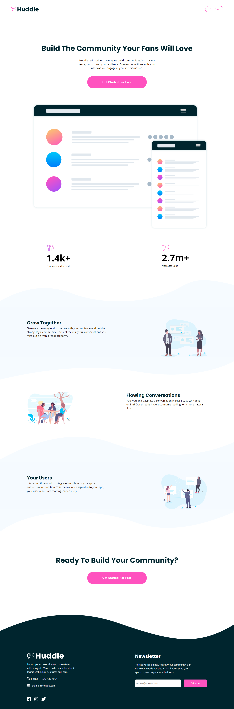

# Frontend Mentor - Product preview card component solution

This is a solution to the [Product preview card component challenge on Frontend Mentor](https://www.frontendmentor.io/challenges/huddle-landing-page-with-curved-sections-5ca5ecd01e82137ec91a50f2).

## Table of contents

- [Overview](#overview)
  - [The challenge](#the-challenge)
  - [Screenshot](#screenshot)
  - [Links](#links)
  - [Built with](#built-with)
  - [What I learned](#what-i-learned)
- [Author](#author)

**Note: Delete this note and update the table of contents based on what sections you keep.**

## Overview

### The challenge

Users should be able to:

- View the optimal layout depending on their device's screen size
- See hover and focus states for interactive elements

### Screenshot

### Links

- Solution URL: [https://www.frontendmentor.io/solutions/huddle-landing-page-with-curved-sections-WyjmjoeY8F]
- Live Site URL: [https://harshilkabra.github.io/Huddle-landing-page/]

### Built with

- Semantic HTML5 markup
- CSS custom properties
- Flexbox

### What I learned

- Mobile first approach
- Using Font Awesome library
- Using Flexbox for responsive layouts

## Author

- Website - [Harshil Kabra](https://www.kabraharshil.wordpress.com)
- Frontend Mentor - [@harshilkabra](https://www.frontendmentor.io/profile/harshilkabra)
- Twitter - [@harshilkabra](https://www.twitter.com/harshilkabra)
